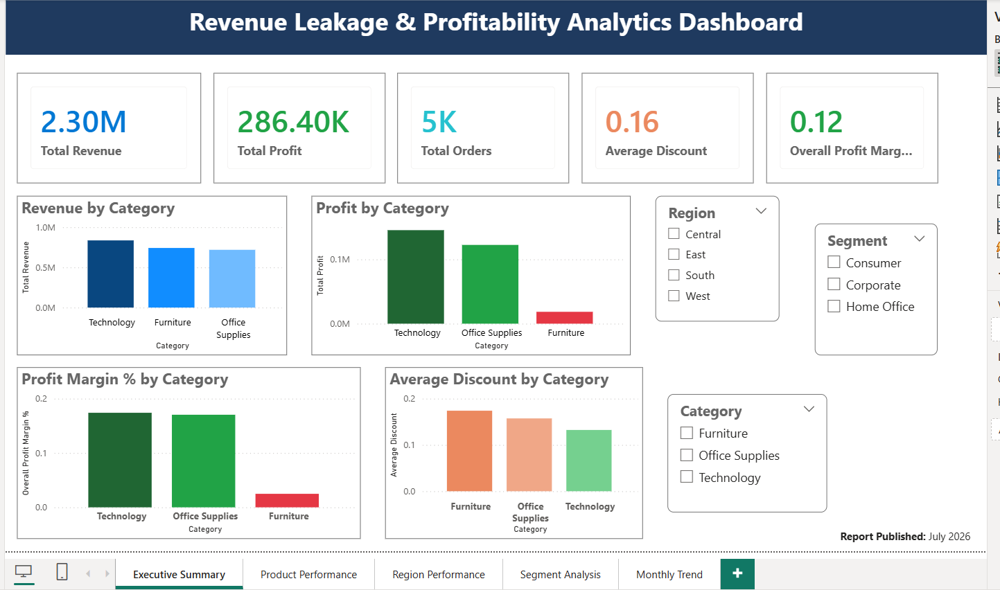
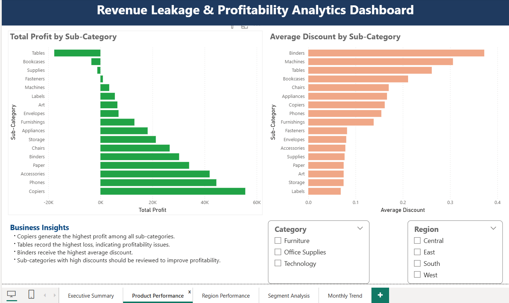
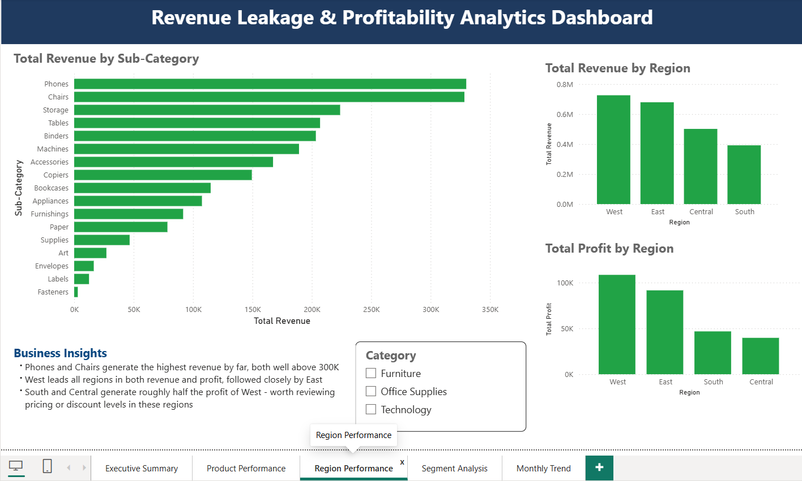
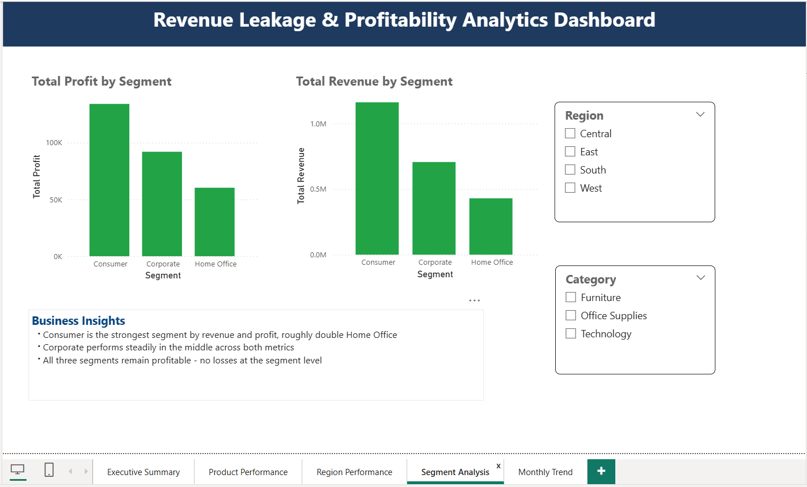
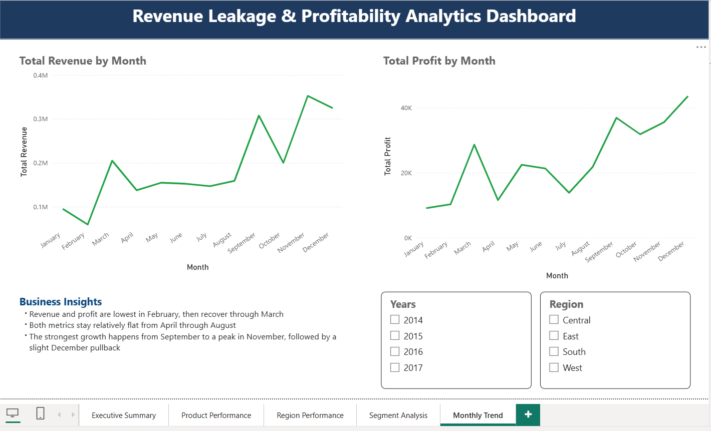

# Revenue Leakage & Profitability Analytics Dashboard

A Power BI dashboard I built to analyze revenue leakage and profitability across regions, customer segments, and product categories using retail order data.

## Overview

I built this project to demonstrate end-to-end analytics skills from raw data to business insights using a retail dataset. The goal was to identify where a business is losing profit despite generating revenue, by breaking down performance across product categories, sub-categories, regions, customer segments, and monthly trends.

## Dashboard Pages

**1. Executive Summary**

High-level KPIs (Total Revenue, Total Profit, Total Orders, Average Discount, Overall Profit Margin) with category-level breakdowns and Region/Segment/Category filters.

**2. Product Performance**

Profit and discount analysis by sub-category. I found that Copiers are the top profit driver, while Tables is the only sub-category operating at a loss.

**3. Region Performance**

Revenue by sub-category alongside regional revenue and profit comparisons. West leads all regions; South and Central show a meaningful profitability gap worth investigating.

**4. Segment Analysis**

Revenue and profit broken down by customer segment (Consumer, Corporate, Home Office), with Region and Category filters for deeper drill-down.

**5. Monthly Trend**

Revenue and profit trends across the year, showing a clear seasonal pattern with the strongest growth from September to November.

## Key Insights

Here's what I found most useful from this analysis:

- **Copiers generate the highest profit** among all sub-categories, while **Tables operates at a loss** - a clear profitability issue worth investigating (pricing or cost structure).
- **Binders receive the highest average discount**, which likely explains some of the margin pressure in that sub-category.
- **West leads all regions** in both revenue and profit; **South and Central generate roughly half** of West's profit - worth reviewing regional pricing and discount strategy.
- **Consumer is the strongest segment**, roughly double Home Office in both revenue and profit, though all three segments remain profitable.
- **Revenue and profit follow a seasonal pattern** - lowest in February, flat through the summer months, and strongest from September to a November peak, with a slight December pullback.

## Tools Used

- **Power BI Desktop** - data modeling, DAX measures, and visualization
- **DAX** - custom measures for Profit Margin %, chronological month sorting, and KPI calculations

## Data Source

UrbanCart Superstore Clean Data dataset (Kaggle) - records covering Category, Sub-Category, Region, Segment, Sales, Profit, Discount, and Order Date, spanning 2014–2017.

## File Structure

```
├── Revenue_Leakage_Profitability_Analytics.pbix   # Power BI dashboard file
├── executive-summary.png
├── product-performance.png
├── region-performance.png
├── segment-analysis.png
├── monthly-trend.png
└── README.md
```

## How to View

Download the `.pbix` file and open it in [Power BI Desktop](https://powerbi.microsoft.com/desktop/) (free) to explore the interactive dashboard, filters, and drill-downs.
This is one of my portfolio projects, built as I complete my MSc in Information Technology and work toward a career in Data Analytics.

**Report Published:** July 2026
